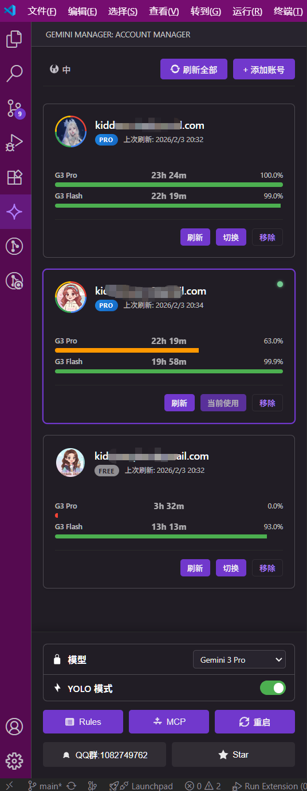
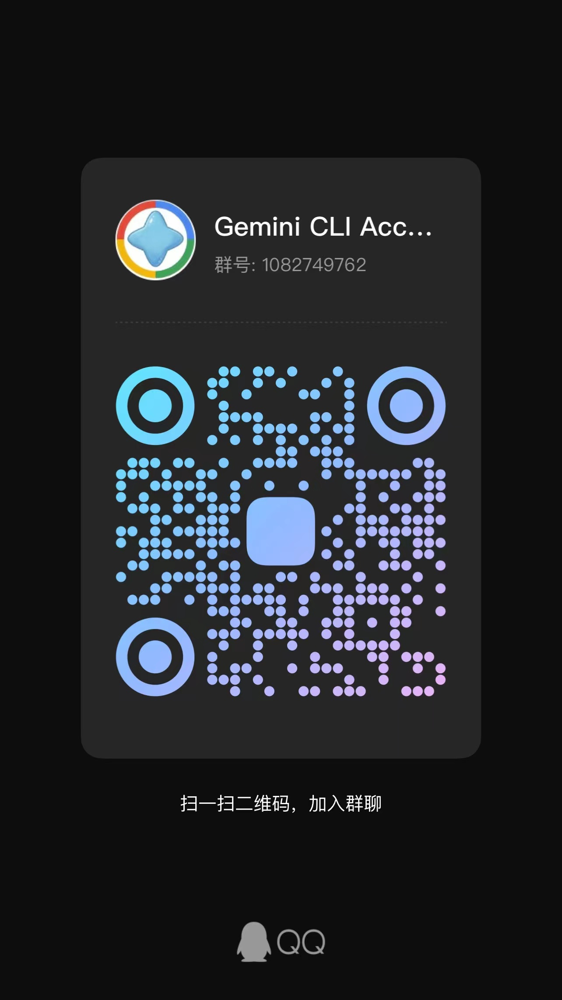

# Gemini CLI Account Manager

[English](README_EN.md)



**Gemini CLI Account Manager** 是一款 VS Code 扩展，专为管理 Gemini CLI 工具的多个 Google 账号凭证而设计。

### 功能特性

- 🔐 **OAuth2 登录**: 使用 Google 账号安全登录。
- 👥 **多账号管理**: 在侧边栏列表中保存和查看多个账号状态。
- ⚡ **一键切换**: 快速在不同账号间切换。切换后会自动更新本地 `~/.gemini/settings.json` 配置文件。
- 🌐 **多语言支持**: 支持英文和简体中文界面切换。

### 使用说明

1. 点击 VS Code 活动栏上的 **Gemini Manager** 图标。
2. 点击 **"+ 添加账号"** 按钮，通过浏览器完成 Google 登录。
3. 在账号卡片上点击 **"切换"** 按钮即可激活该账号。
4. 点击顶部的 **"ZH/EN"** 按钮可切换语言。

### 交流群

如果您在使用过程中遇到问题，欢迎加入 QQ 交流群：



### 开发指南

本项目使用 **Webpack** 进行构建和凭证注入。

1. **安装依赖**:
   ```bash
   npm install
   ```

2. **环境配置**:
   在项目根目录创建一个 `.env` 文件，并填入您的 Google OAuth 凭证（构建时会自动注入）：
   ```env
   GOOGLE_CLIENT_ID=您的客户端ID
   GOOGLE_CLIENT_SECRET=您的客户端密钥
   ```

3. **调试运行**:
   在 VS Code 中按 `F5`。

4. **打包发布**:
   ```bash
   npm run package
   ```

## License

MIT
