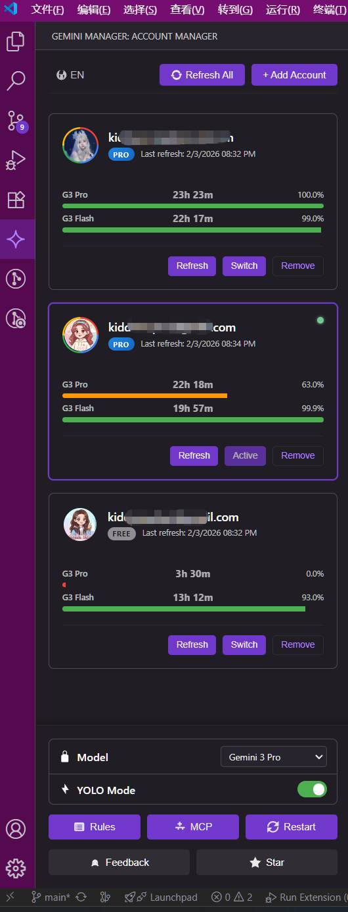

# Gemini CLI Account Manager

[简体中文](README.md)



**Gemini CLI Account Manager** is a VS Code extension designed to manage multiple Google account credentials for the Gemini CLI tool efficiently.

### Features

- 🔐 **OAuth2 Login**: Securely authenticate using Google Accounts.
- 👥 **Multi-Account Management**: Save and view multiple accounts in a clean sidebar list.
- ⚡ **One-Click Switch**: Instantly switch between accounts. This automatically updates your `~/.gemini/settings.json` with the selected account's credentials.
- 🌐 **I18n Support**: Switch between English and Simplified Chinese interfaces.

### Usage

1. Click the **Gemini Manager** icon in the VS Code Activity Bar.
2. Click **"+ Add Account"** to log in with a new Google Account via browser.
3. Click the **"Switch"** button on an account card to make it active.
4. Use the **"ZH/EN"** button in the header to toggle languages.

### Development

This project uses **Webpack** for bundling and credential injection.

1. **Install Dependencies**:
   ```bash
   npm install
   ```

2. **Setup Environment**:
   Create a `.env` file in the root directory and add your Google OAuth credentials (these will be injected during build):
   ```env
   GOOGLE_CLIENT_ID=your_client_id
   GOOGLE_CLIENT_SECRET=your_client_secret
   ```

3. **Run in Debug Mode**:
   Press `F5` in VS Code.

4. **Build Package**:
   ```bash
   npm run package
   ```

## License

MIT
